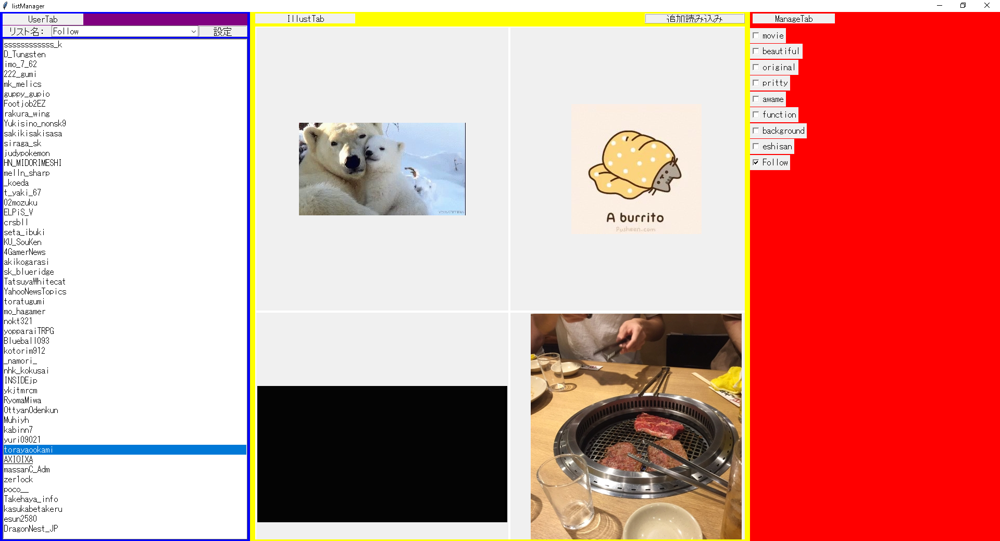

# listManager
自作ソフト「listEditor」の改修版です。pythonで書かれているため、パッケージが対応していればどの環境でも動作します。
起動後画像

# What is listManager?
listManagerは、友人の要請でTwitterで活躍しているイラストレーターさんをまとめたリストを分類分けするために利用します。
listManagerでは、以下のことが可能です。
1. フォローしているユーザ及び公開リストのユーザの表示，選択（UserTab：青色）
2. 選択したユーザが投稿した画像の閲覧（IllustTab：黄色）
3. 任意の公開リストへのユーザの追加，削除（ManageTab：赤色）

# Environmnet
Twitterを元に動くため，TwitterのIDが必要です。
python - 3.7.1，3.8.1で動作確認

# Library
1. python-twitter - pip, Twitter APIへのリクエストに使用
2. oauth2 - pip, API利用のためのoauth認証に利用
3. urllib3 - pip, httpリクエストに利用
4. screeminfo - pip, ディスプレイ情報を取得するために利用
5. pillow - pip, tkinterでpngやjpgを扱うために利用

# Usage
本ソフトウェアはWindows用です。他OSでの動作の場合、パッケージが対応していない可能性があります。pipにてパッケージを導入するため、仮想環境の構築工程が含まれていますが、必要のない場合は飛ばしていただいて構いません。環境によってはsqlite等の追加のパッケージを求められる可能性があります。
1. git clone でソースコードをダウンロード
2. cd listManager でクローンしたlistManagerのディレクトリに移動
3. py -m venv listManager_venv で仮想環境の作成
4. pip install -r requirements.txt で必要なパッケージをダウンロード
5. py modules\listManager.py で起動
